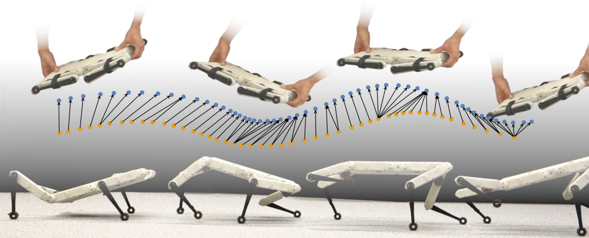

# WASABI with Solo

This repository provides the [Wasserstein Adversarial Behavior Imitation (WASABI)](https://arxiv.org/abs/2206.11693) algorithm that enables [Solo](https://open-dynamic-robot-initiative.github.io/) to acquire agile skills through adversarial imitation from rough, partial demonstrations using [NVIDIA Isaac Gym](https://developer.nvidia.com/isaac-gym).



**Paper**: [Learning Agile Skills via Adversarial Imitation of Rough Partial Demonstrations](https://arxiv.org/abs/2206.11693)  
**Project website**: https://sites.google.com/view/corl2022-wasabi/home

**Maintainer**: [Chenhao Li](https://breadli428.github.io/)  
**Affiliation**: [Autonomous Learning Group](https://al.is.mpg.de/), [Max Planck Institute for Intelligent Systems](https://is.mpg.de/), and [Robotic Systems Lab](https://rsl.ethz.ch/), [ETH Zurich](https://ethz.ch/en.html)  
**Contact**: [chenhli@ethz.ch](mailto:chenhli@ethz.ch)

## Installation

1. Create a new python virtual environment with `python 3.8`
2. Install `pytorch 1.10` with `cuda-11.3`
        
        pip3 install torch==1.10.0+cu113 torchvision==0.11.1+cu113 torchaudio==0.10.0+cu113 -f https://download.pytorch.org/whl/cu113/torch_stable.html

3. Install Isaac Gym

   - Download and install [Isaac Gym Preview 4](https://developer.nvidia.com/isaac-gym)

        ```
        cd isaacgym/python
        pip install -e .
        ```

   - Try running an example

        ```
        cd examples
        python 1080_balls_of_solitude.py
        ```

   - For troubleshooting, check docs in `isaacgym/docs/index.html`

4. Install `solo_gym`

        git clone https://github.com/breadli428/solo_gym.git
        cd solo_gym
        pip install -e .

## Configuration
- The Solo environment is defined by an env file `solo8.py` and a config file `solo8_config.py` under `solo_gym/envs/solo8/`. The config file sets both the environment parameters in class `Solo8FlatCfg` and the training parameters in class `Solo8FlatCfgPPO`.
- The provided code examplifies the training of Solo 8 with [handheld wave motions](https://youtu.be/25ZCCkwSztc?feature=shared). 20 recorded demonstrations are augmented with perturbations to 1000 trajectoires with 130 frames and stored in `resources/robots/solo8/datasets/motion_data.pt`. The state dimension indices are specified in `reference_state_idx_dict.json`. To train with other demonstrations, replace `motion_data.pt` and adapt reward functions defined in `solo_gym/envs/solo8/solo8.py` accordingly.


## Usage

### Train

```
python scripts/train.py --task solo8
```

- The trained policy is saved in `logs/<experiment_name>/<date_time>_<run_name>/model_<iteration>.pt`, where `<experiment_name>` and `<run_name>` are defined in the train config.
- To disable rendering, append `--headless`.

### Play a trained policy

```
python scripts/play.py
```

- By default the loaded policy is the last model of the last run of the experiment folder.
- Other runs/model iteration can be selected by setting `load_run` and `checkpoint` in the train config.
- Use `u` and `j` to command the forward velocity.

## Citation
```
@inproceedings{li2023learning,
  title={Learning agile skills via adversarial imitation of rough partial demonstrations},
  author={Li, Chenhao and Vlastelica, Marin and Blaes, Sebastian and Frey, Jonas and Grimminger, Felix and Martius, Georg},
  booktitle={Conference on Robot Learning},
  pages={342--352},
  year={2023},
  organization={PMLR}
}
```

## References

The code is built upon the open-sourced [Isaac Gym Environments for Legged Robots](https://github.com/leggedrobotics/legged_gym) and the [PPO implementation](https://github.com/leggedrobotics/rsl_rl). We refer to the original repositories for more details.
