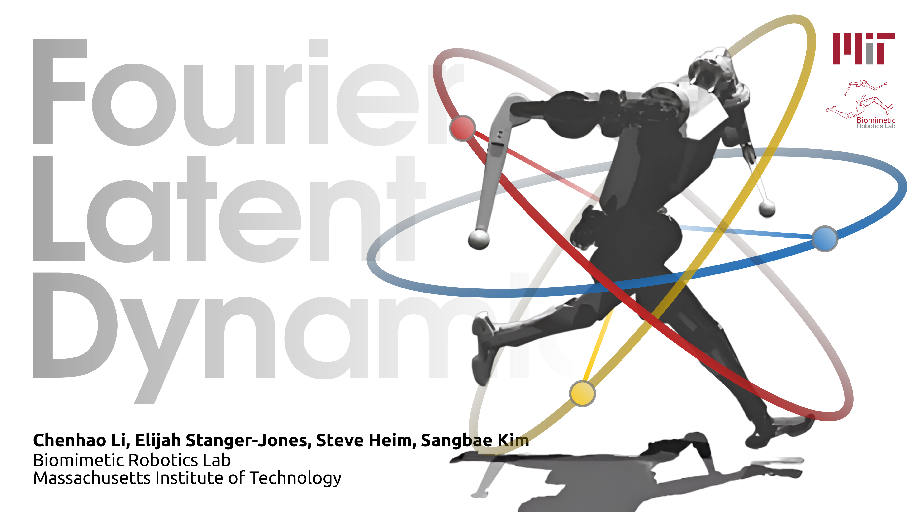

# FLD with MIT Humanoid

This repository provides the [Fourier Latent Dynamics (FLD)](https://arxiv.org/abs/2206.11693) algorithm that represents high-dimension, long-horizon, highly nonlinear, period or quasi-period data in a continuously parameterized space. This work demonstrates its representation and generation capability with a robotic motion tracking task on [MIT Humanoid](https://spectrum.ieee.org/mit-dynamic-acrobatic-humanoid-robot) using [NVIDIA Isaac Gym](https://developer.nvidia.com/isaac-gym).



**Paper**: [FLD: Fourier Latent Dynamics for Structured Motion Representation and Learning](https://arxiv.org/abs/2206.11693)  
**Project website**: https://sites.google.com/view/iclr2024-fld/home

**Maintainer**: [Chenhao Li](https://breadli428.github.io/)  
**Affiliation**: [Biomimetic Robotics Lab](https://biomimetics.mit.edu/), [Massachusetts Institute of Technology](https://www.mit.edu/)  
**Contact**: [chenhli@mit.edu](mailto:chenhli@mit.edu)

## Installation

1. Create a new python virtual environment with `python 3.8`
2. Install `pytorch 1.10` with `cuda-11.3`
        
        pip3 install torch==1.10.0+cu113 torchvision==0.11.1+cu113 torchaudio==0.10.0+cu113 -f https://download.pytorch.org/whl/cu113/torch_stable.html

3. Install Isaac Gym

   - Download and install [Isaac Gym Preview 4](https://developer.nvidia.com/isaac-gym)

        ```
        cd isaacgym/python
        pip install -e .
        ```

   - Try running an example

        ```
        cd examples
        python 1080_balls_of_solitude.py
        ```

   - For troubleshooting, check docs in `isaacgym/docs/index.html`

4. Install `humanoid_gym`

        git clone https://github.com/mit-biomimetics/fld.git
        cd humanoid_gym
        pip install -e .

## Configuration
- The workflow consists of two main stages: motion representation and motion learning. In the first stage, the motion data is represented in the latent space using FLD. In the second stage, the latent space is used to train a policy for the robot.
- The provided code examplifies the training of FLD with human motion data retargeted to MIT Humanoid. The dataset of [9 different motions](https://youtu.be/MVkg18c5aaU) is stored under `resources/robots/mit_humanoid/datasets/misc`. 10 trajectories of 240 frames for each motion are stored in a separate `.pt` file with the format `motion_data_<motion_name>.pt`. The state dimension indices are specified in `reference_state_idx_dict.json` under `resources/robots/mit_humanoid/datasets/misc`.
- The MIT Humanoid environment is defined by an env file `mit_humanoid.py` and a config file `mit_humanoid_config.py` under `humanoid_gym/envs/mit_humanoid/`. The config file sets both the environment parameters in class `MITHumanoidFlatCfg` and the training parameters in class `MITHumanoidFlatCfgPPO`.


## Usage

### FLD Training

```
python scripts/fld/experiment.py
```

- The training process is visualized by inspecting the Tensorboard logs at `logs/<experiment_name>/fld/misc/`. The figures include the FLD loss, the reconstruction of sampled trajectories for each motion, the latent parameters in each latent channel along sampled trajectories for each motion with the formed latent manifold, and the latent parameter distribution.
- The trained FLD model is saved in `logs/<experiment_name>/fld/misc/model_<iteration>.pt`, where `<experiment_name>` is defined in the experiment config.
- A `statistics.pt` file is saved in the same folder, containing the mean and standard deviation of the input data and the statistics of the latent parameterization space. This file is used to normalize the input data and to define plotting ranges during policy training.

### FLD Evaluation

```
python scripts/fld/evaluate.py
```

- A `latent_params.pt` file is saved in the same folder, containing the latent parameters of the input data. This file is used to define the input data for policy training with the offline task sampler.
- A `gmm.pt` file is saved in the same folder, containing the Gaussian Mixture Model (GMM) of the latent parameters. This file is used to define the input data distribution for policy training with the offline gmm task sampler.
- A set of latent parameters is sampled and reconstructed to the original motion space. The decoded motion is saved in `resources/robots/mit_humanoid/datasets/decoded/motion_data.pt`. Figure 1 shows the latent sample and the reconstructed motion trajectory. Figure 2 shows the sampled latent parameters. Figure 3 shows the latent manifold of the sampled trajectory, along with the original ones. Figure 4 shows the GMM of the latent parameters.

### Motion Visualization

```
python scripts/fld/preview.py
```
- The decoded motion reconstructed from the sampled latent parameters is visualized in the Isaac Gym environment. Note that the motion contains only kinematic and proprioceptive information. The global position and orientation are approximated by integrating the velocity information with finite difference.

### Policy Training

```
python scripts/train.py --task mit_humanoid
```

- Configure the training parameters in `humanoid_gym/envs/mit_humanoid/mit_humanoid_config.py`.
- Choose the task sampler by setting `MITHumanoidFlatCfgPPO.runner.task_sampler_class_name` to `OfflineSampler`, `GMMSampler`, `RandomSampler` or `ALPGMMSampler`.
- The trained policy is saved in `logs/<experiment_name>/<date_time>_<run_name>/model_<iteration>.pt`, where `<experiment_name>` and `<run_name>` are defined in the train config.
- To disable rendering, append `--headless`.

### Policy Playing

```
python scripts/play.py
```

- By default the loaded policy is the last model of the last run of the experiment folder.
- Other runs/model iteration can be selected by setting `load_run` and `checkpoint` in the train config.
- The target motions are randomly selected from the dataset from the path specified by `datasets_root`. These motions are first encoded to the latent space and then sent to the policy for execution.
- The fallback mechanism is enabled by default with a theshold of 1.0 on `dynamics_error`.

## Troubleshooting
```
RuntimeError: nvrtc: error: invalid value for --gpu-architecture (-arch)
```
- This error occurs when the CUDA version is not compatible with the installed PyTorch version. A quick fix is to comment out decorator `@torch.jit.script` in `isaacgym/python/isaacgym/torch_utils.py`.


## Known Issues
The `ALPGMMSampler` utilizes [faiss](https://github.com/facebookresearch/faiss) for efficient similarity search and clustering of dense vectors in the latent parameterization space. The installation of `faiss` requires a compatible CUDA version. The current implementation is tested with `faiss-cpu` and `faiss-gpu` with `cuda-10.2`.


## Citation
```
@inproceedings{li2024fourier,
  title={Fld: fourier latent dynamics for structured motion representation and learning},
  author={Li, Chenhao and Stanger-Jones, Elijah and Heim, Steve and Kim, Sangbae},
  booktitle={International Conference on Learning Representations},
  pages={342--352},
  year={2024},
  organization={PMLR}
}
```

## References

The code is built upon the open-sourced [Periodic Autoencoder (PAE) Implementation](https://github.com/sebastianstarke/AI4Animation/tree/master/AI4Animation/SIGGRAPH_2022/PyTorch/PAE), [Isaac Gym Environments for Legged Robots](https://github.com/leggedrobotics/legged_gym) and the [PPO implementation](https://github.com/leggedrobotics/rsl_rl). We refer to the original repositories for more details.
